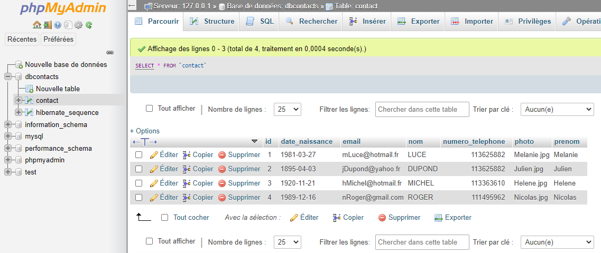

# Application J2E-Spring-Angular

Application:

Creer une application Web JEE qui permet de gerer des contacts (id, nom, prenom, date de naissance, email, telephone et photo) a l'aide d'un CRUD.


>L'application se compose de deux partie: Un backend en Spring, API RestFull et un frontend en angular. Nous utiliserons une base de donnees MySql.


# Creation de l'application

## Initilisation projet

* New projet spring boot. A l'aide de l'initializer Spring ajouter les depences suivantes dans votre projet maven:


```java
<?xml version="1.0" encoding="UTF-8"?>
<project xmlns="http://maven.apache.org/POM/4.0.0" xmlns:xsi="http://www.w3.org/2001/XMLSchema-instance"
	xsi:schemaLocation="http://maven.apache.org/POM/4.0.0 https://maven.apache.org/xsd/maven-4.0.0.xsd">
	<modelVersion>4.0.0</modelVersion>
	<parent>
		<groupId>org.springframework.boot</groupId>
		<artifactId>spring-boot-starter-parent</artifactId>
		<version>2.4.0</version>
		<relativePath/> <!-- lookup parent from repository -->
	</parent>
	<groupId>com.ruffin</groupId>
	<artifactId>JEE_SPRING_ANGULAR</artifactId>
	<version>0.0.1-SNAPSHOT</version>
	<name>JEE_SPRING_ANGULAR</name>
	<description>Demo application J2E Spring Angular</description>

	<properties>
		<java.version>15</java.version>
	</properties>

	<dependencies>
		<dependency>
			<groupId>org.springframework.boot</groupId>
			<artifactId>spring-boot-starter-data-jpa</artifactId>
		</dependency>
		<dependency>
			<groupId>org.springframework.boot</groupId>
			<artifactId>spring-boot-starter-web</artifactId>
		</dependency>

		<dependency>
			<groupId>org.springframework.boot</groupId>
			<artifactId>spring-boot-devtools</artifactId>
			<scope>runtime</scope>
			<optional>true</optional>
		</dependency>
		<dependency>
			<groupId>mysql</groupId>
			<artifactId>mysql-connector-java</artifactId>
			<scope>runtime</scope>
		</dependency>
		<dependency>
			<groupId>org.springframework.boot</groupId>
			<artifactId>spring-boot-starter-test</artifactId>
			<scope>test</scope>
		</dependency>
	</dependencies>

	<build>
		<plugins>
			<plugin>
				<groupId>org.springframework.boot</groupId>
				<artifactId>spring-boot-maven-plugin</artifactId>
			</plugin>
		</plugins>
	</build>

</project>

```

* Ajout d'un fichier Readme et gitignore au projet

* Initialisation depot git

```cmd
cd JEE_SPRING_ANGULAR
git init
git add .
git commit -am "init projet"
```

* Creation d'un repository dans github

* Faire le lien entre le repository local et Github

```cmd
git branch -M main
git remote add origin https://github.com/jeanyvesruffin/JEE-Spring-Angular.git
git push -u origin main
```

# Creation backEnd

## Creation des packages DAO et ENTITY

1. Creation **Entite** (Classe Contact package com.ruffin.entities). Annote: @Entity,@Id @GeneratedValue, @Temporal(TemporalType.DATE), issu de la librairie javax.persistence.
2. Creation **interface** Jpa Repository (classe: ContactRepository package com.ruffin.dao).
3. Creation jeu de **Test** notre repository en ajoutant implementation CommadLineRunner(Classe JeeSpringAngularApplication package com.ruffin).
4. Creation configuration application.properties

## Demarrage des serveurs a l'aide de XAMPP

Ajout et demarrage des serveurs (Apache et Mysql) a l'aide de Xampp.


Creation de la base de donnees dbcontacts et demarrage de l'application spring. 

Rafraichire votre navigateur afin de constater la creation de votre table contact:




## Creation du package Web et mise en oeuvre Services Rest

1 . Creation **service Rest** (classe ContactRestService package com.ruffin.web). Annote: @RestController @Autowired . Si vous interrogez l'adresse url: http://localhost:8080/contacts , vous observerez le Json de retour de la requete. Avec l'url http://localhost:8080/contacts/{id} nous obtenons l'id en question. A l'aide de ARC/POSTMAN ou SOAPUI vous pouvez ajouter un contact.

2 . Ajout methode pour la recherche de contact (interface ContactRepository, package com.ruffin.dao).

3 . Trics interessant indiquer "%"+[variable]+"%" Permet de stipuler qu'il y a des "trucs" avant et apres qui seront accepter.


```java
@RestController
public class ContactRestService {
	@Autowired
	private ContactRepository contactRepository;

	// Consulter la liste des contacts
	@RequestMapping(value = "/contacts", method = RequestMethod.GET)
	public List<Contact> getContacts() {
		return contactRepository.findAll();
	}

	// Consulter un id en particulier
	@RequestMapping(value = "/contacts/{id}", method = RequestMethod.GET)
	public Optional<Contact> getContacts(@PathVariable Long id) {
		return contactRepository.findById(id);
	}

	// Ajouter un contact
	@RequestMapping(value = "/contacts", method = RequestMethod.POST)
	public Contact save(@RequestBody Contact contact) {
		return contactRepository.save(contact);
	}

	// Supprimer un contact
	@RequestMapping(value = "/contacts/{id}", method = RequestMethod.DELETE)
	public boolean deleteContact(@PathVariable Long id) {
		contactRepository.deleteById(id);
		return true;
	}

	// Update un contact
	@RequestMapping(value = "/contacts/{id}", method = RequestMethod.PUT)
	public Contact save(@PathVariable Long id, @RequestBody Contact contact) {
		contact.setId(id);
		return contactRepository.save(contact);
	}

	// rechercher la page contenant la list des contacts
	@RequestMapping(value = "/chercherContacts", method = RequestMethod.GET)
	public Page<Contact> chercher(@RequestParam(name = "motCle", defaultValue = "") String motCle,
			@RequestParam(name = "page", defaultValue = "0") int page,
			@RequestParam(name = "size", defaultValue = "5") int size) {
		Pageable sortedById = PageRequest.of(page, size, Sort.by("id"));
		return contactRepository.chercher("%" + motCle + "%", sortedById);
	}

}
```

```java
public interface ContactRepository extends JpaRepository<Contact, Long> {

	@Query("select contact from Contact contact where contact.nom like :x")
	public Page<Contact> chercher(@Param("x") String motCle, Pageable pageable);

}
```

Lors de l'execution de l'url: http://localhost:8080/chercherContacts?motCle=D nous obtenons la liste des contacts commencant par la lettre "D" (page et size pouvant etre ajoutes)

# Creation FrontEnd (Angular)

## Installation outils pour Angular

Installation de Node JS puis installer angular cli

```cmd
npm install -g @angular/cli
```

Verifications des verstion d'installation

```cmd
node -v
v15.3.0
npm -v
7.0.14
ng v
     _                      _                 ____ _     ___
    / \   _ __   __ _ _   _| | __ _ _ __     / ___| |   |_ _|
   / △ \ | '_ \ / _` | | | | |/ _` | '__|   | |   | |    | |
  / ___ \| | | | (_| | |_| | | (_| | |      | |___| |___ | |
 /_/   \_\_| |_|\__, |\__,_|_|\__,_|_|       \____|_____|___|
                |___/
    

Angular CLI: 11.0.3
Node: 15.3.0
OS: win32 x64

Angular: undefined
...
Ivy Workspace: <error>

Package                      Version
------------------------------------------------------
@angular-devkit/architect    0.1100.3 (cli-only)
@angular-devkit/core         11.0.3 (cli-only)
@angular-devkit/schematics   11.0.3 (cli-only)
@schematics/angular          11.0.3 (cli-only)
@schematics/update           0.1100.3 (cli-only)


D:\PROGRAMMING\JEE_SPRING_ANGULAR\JEE-Spring-Angular>node -v
v15.3.0

D:\PROGRAMMING\JEE_SPRING_ANGULAR\JEE-Spring-Angular>npm -v
7.0.14

D:\PROGRAMMING\JEE_SPRING_ANGULAR\JEE-Spring-Angular>ng v

     _                      _                 ____ _     ___
    / \   _ __   __ _ _   _| | __ _ _ __     / ___| |   |_ _|
   / △ \ | '_ \ / _` | | | | |/ _` | '__|   | |   | |    | |
  / ___ \| | | | (_| | |_| | | (_| | |      | |___| |___ | |
 /_/   \_\_| |_|\__, |\__,_|_|\__,_|_|       \____|_____|___|
                |___/
    

Angular CLI: 11.0.3
Node: 15.3.0
OS: win32 x64

Angular: undefined
...
Ivy Workspace: <error>

Package                      Version
------------------------------------------------------
@angular-devkit/architect    0.1100.3 (cli-only)
@angular-devkit/core         11.0.3 (cli-only)
@angular-devkit/schematics   11.0.3 (cli-only)
@schematics/angular          11.0.3 (cli-only)
@schematics/update           0.1100.3 (cli-only)
```

