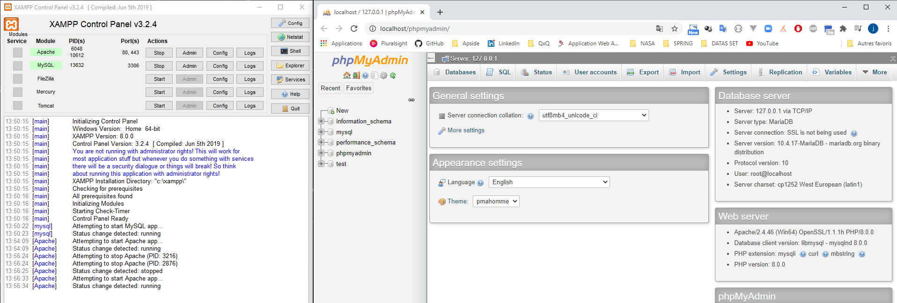

# Application J2E-Spring-Angular

Application:

Creer une application Web JEE qui permet de gerer des contacts (id, nom, prenom, date de naissance, email, telephone et photo) a l'aide d'un CRUD.


>L'application se compose de deux partie: Un backend en Spring, API RestFull et un frontend en angular. Nous utiliserons une base de donnees MySql.


# Creation de l'application

## Initilisation projet

* New projet spring boot. A l'aide de l'initializer Spring ajouter les depences suivantes dans votre projet maven:


```java
<?xml version="1.0" encoding="UTF-8"?>
<project xmlns="http://maven.apache.org/POM/4.0.0" xmlns:xsi="http://www.w3.org/2001/XMLSchema-instance"
	xsi:schemaLocation="http://maven.apache.org/POM/4.0.0 https://maven.apache.org/xsd/maven-4.0.0.xsd">
	<modelVersion>4.0.0</modelVersion>
	<parent>
		<groupId>org.springframework.boot</groupId>
		<artifactId>spring-boot-starter-parent</artifactId>
		<version>2.4.0</version>
		<relativePath/> <!-- lookup parent from repository -->
	</parent>
	<groupId>com.ruffin</groupId>
	<artifactId>JEE_SPRING_ANGULAR</artifactId>
	<version>0.0.1-SNAPSHOT</version>
	<name>JEE_SPRING_ANGULAR</name>
	<description>Demo application J2E Spring Angular</description>

	<properties>
		<java.version>15</java.version>
	</properties>

	<dependencies>
		<dependency>
			<groupId>org.springframework.boot</groupId>
			<artifactId>spring-boot-starter-data-jpa</artifactId>
		</dependency>
		<dependency>
			<groupId>org.springframework.boot</groupId>
			<artifactId>spring-boot-starter-web</artifactId>
		</dependency>

		<dependency>
			<groupId>org.springframework.boot</groupId>
			<artifactId>spring-boot-devtools</artifactId>
			<scope>runtime</scope>
			<optional>true</optional>
		</dependency>
		<dependency>
			<groupId>mysql</groupId>
			<artifactId>mysql-connector-java</artifactId>
			<scope>runtime</scope>
		</dependency>
		<dependency>
			<groupId>org.springframework.boot</groupId>
			<artifactId>spring-boot-starter-test</artifactId>
			<scope>test</scope>
		</dependency>
	</dependencies>

	<build>
		<plugins>
			<plugin>
				<groupId>org.springframework.boot</groupId>
				<artifactId>spring-boot-maven-plugin</artifactId>
			</plugin>
		</plugins>
	</build>

</project>

```

* Ajout d'un fichier Readme et gitignore au projet

* Initialisation depot git

```cmd
cd JEE_SPRING_ANGULAR
git init
git add .
git commit -am "init projet"
```

* Creation d'un repository dans github

* Faire le lien entre le repository local et Github

```cmd
git branch -M main
git remote add origin https://github.com/jeanyvesruffin/JEE-Spring-Angular.git
git push -u origin main
```

# Creation backEnd

## Creation DAO et ENTITY

1. Creation **Entite** (Classe Contact package com.ruffin.entities). Annote: @Entity,@Id @GeneratedValue, @Temporal(TemporalType.DATE), issu de la librairie javax.persistence.
2. Creation **interface** Jpa Repository (classe: ContactRepository package com.ruffin.dao).
3. Creation jeu de **Test** notre repository en ajoutant implementation CommadLineRunner(Classe JeeSpringAngularApplication package com.ruffin).
4. Creation configuration application.properties

## Demarrage des serveurs a l'aide de XAMPP

Ajout et demarrage des serveurs a l'aide de Xampp.




